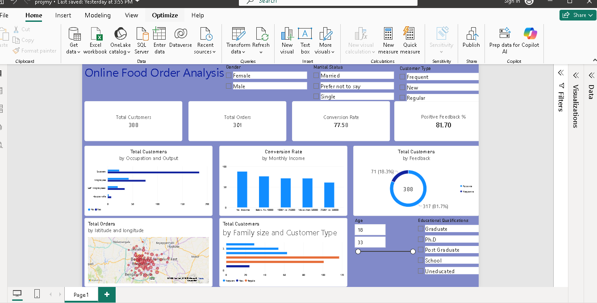

# Online Food Order Analysis

An end-to-end data analytics project analyzing customer food ordering behavior and demographics.

## Dashboard Preview

## Key Insights
- **Overall Conversion Rate:** 77.58% (301 out of 388 respondents placed orders).
- **Core Segment:** Students represent over 53% of respondents with an 88.89% order conversion rate.
- **Customer Satisfaction:** 81.7% positive feedback overall.

## Tech Stack
- **Database:** SQL (`myproj.sql`)
- **Reporting:** Power BI (`projmy.pbix`)
